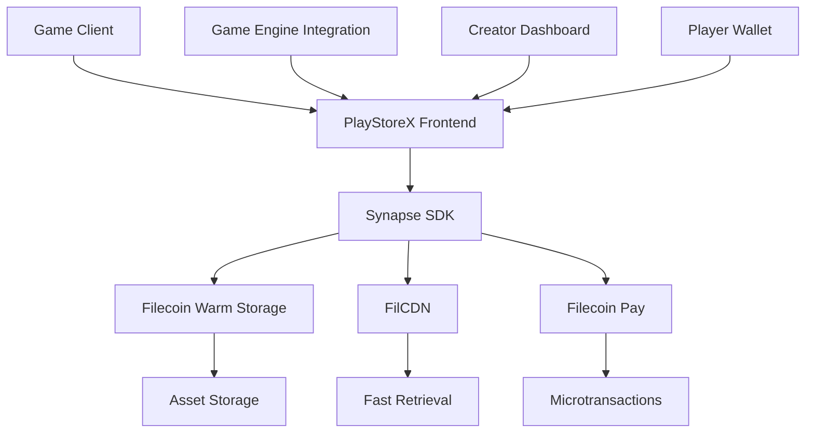

# PlayStoreX - Web3 Gaming Asset Cloud


**A decentralized gaming asset marketplace built on Filecoin Onchain Cloud**

PlayStoreX is revolutionizing the gaming industry by providing a censorship-resistant, decentralized platform for hosting in-game assets, player-generated content, and enabling microtransactions through Filecoin's infrastructure.

## 🎮 Problem Statement

The gaming industry faces critical challenges with centralized asset management:

- **Asset Loss Risk**: Games rely on centralized servers for skins, assets, and DLCs. When servers go offline, valuable player assets vanish forever
- **Censorship Vulnerability**: Centralized platforms can remove content based on arbitrary decisions
- **High Infrastructure Costs**: Game studios face expensive CDN and storage costs for asset delivery
- **Limited Monetization**: Creators struggle with platform fees and payment processing limitations
- **Fragmented Ecosystems**: Assets are locked within specific game ecosystems, limiting interoperability

## 🚀 Solution & Value Proposition

PlayStoreX leverages Filecoin Onchain Cloud to create a "Steam on Filecoin" - a sustainable, decentralized gaming asset ecosystem that provides:

### Core Features
- **Decentralized Asset Storage**: Host in-game assets, skins, mods, and player-generated content on Filecoin Warm Storage
- **Blazing Fast Delivery**: Utilize FilCDN for sub-second asset retrieval globally
- **Microtransaction Support**: Enable pay-per-asset and subscription models through Filecoin Pay
- **Censorship Resistance**: Assets remain accessible regardless of platform decisions
- **Cross-Game Interoperability**: Assets can be used across multiple games and platforms
- **Creator Economy**: Direct monetization for modders and content creators

### Value Proposition
- **For Game Studios**: Reduce infrastructure costs by 60-80% while ensuring asset permanence
- **For Players**: Own your assets permanently with guaranteed access
- **For Creators**: Direct monetization without platform fees
- **For Developers**: Easy integration with existing game engines

## 🏗️ Technical Architecture

### Filecoin Onchain Cloud Integration



### Key Components

#### 1. **Asset Management System**
- **Warm Storage Integration**: Store game assets with PDP (Proof of Data Possession) verification
- **CDN Acceleration**: Leverage FilCDN for global content delivery
- **Asset Metadata**: Comprehensive asset information and versioning

#### 2. **Payment Infrastructure**
- **Filecoin Pay Integration**: Support for FIL and ERC-20 payments
- **Microtransaction Support**: Pay-per-asset and subscription models
- **Revenue Sharing**: Automated creator compensation

#### 3. **Developer SDK**
- **Unity Integration**: Easy plugin for Unity-based games
- **Unreal Engine Support**: Native integration for Unreal Engine
- **Web3 Gaming APIs**: RESTful APIs for asset management

## 🛠️ Technology Stack

### Frontend
- **Next.js 15**: React framework with App Router
- **TypeScript**: Type-safe development
- **Tailwind CSS**: Utility-first styling
- **Framer Motion**: Smooth animations

### Blockchain Integration
- **Synapse SDK**: Filecoin Onchain Cloud integration
- **Wagmi**: React hooks for Ethereum
- **RainbowKit**: Wallet connection
- **Ethers.js**: Ethereum library

### Filecoin Services
- **Filecoin Warm Storage**: Asset persistence with PDP verification
- **FilCDN**: Content delivery network for fast retrieval
- **Filecoin Pay**: Payment processing and settlement

## 📦 Installation & Setup

### Prerequisites
- Node.js 18+ and npm/pnpm
- A web3 wallet (MetaMask recommended)
- Basic understanding of React and TypeScript
- Get tFIL tokens on Filecoin Calibration testnet: [Faucet](https://faucet.calibnet.chainsafe-fil.io/funds.html)
- Get USDFC tokens on Filecoin Calibration testnet: [Faucet](https://forest-explorer.chainsafe.dev/faucet/calibnet_usdfc)

### Quick Start

1. **Clone the repository**:
```bash
git clone https://github.com/FilOzone/playstorex-gaming-cloud
cd playstorex-gaming-cloud
```

2. **Install dependencies**:
```bash
pnpm install
```

3. **Configure environment**:
```bash
cp .env.example .env.local
# Edit .env.local with your configuration
```

4. **Run the development server**:
```bash
pnpm dev
```

5. **Open your browser**:
Navigate to [http://localhost:3000](http://localhost:3000)

## 🎯 Usage Examples

### For Game Developers

```typescript
import { PlayStoreXClient } from '@playstorex/sdk';

const client = new PlayStoreXClient({
  network: 'calibration',
  wallet: userWallet
});

// Upload game asset
const asset = await client.uploadAsset({
  file: gameAssetFile,
  metadata: {
    name: 'Epic Sword Skin',
    category: 'weapons',
    gameId: 'fantasy-rpg-v1',
    price: '0.1 FIL'
  }
});

// Enable CDN for fast delivery
await client.enableCDN(asset.id);
```

### For Players

```typescript
// Purchase asset
const purchase = await client.purchaseAsset({
  assetId: 'asset-123',
  paymentMethod: 'FIL'
});

// Download asset
const assetData = await client.downloadAsset(assetId);
```

## 🚀 Deployment

### Production Deployment

1. **Build the application**:
```bash
pnpm build
```

2. **Deploy to Vercel**:
```bash
vercel --prod
```

3. **Configure Filecoin Mainnet**:
Update configuration for production environment

### Docker Deployment

```bash
docker build -t playstorex .
docker run -p 3000:3000 playstorex
```

## 📊 Business Model

### Revenue Streams
1. **Transaction Fees**: 2.5% on asset sales
2. **Storage Fees**: Premium storage options
3. **CDN Usage**: Pay-per-download for high-traffic assets
4. **Developer Tools**: Premium SDK features

### Market Opportunity
- **Gaming Market**: $200B+ global market
- **Asset Trading**: $50B+ in-game asset market
- **Creator Economy**: $104B+ creator economy

## 🎯 Roadmap

### Phase 1: MVP (Current)
- [x] Basic asset upload and storage
- [x] Filecoin Warm Storage integration
- [x] Payment processing with Filecoin Pay
- [x] CDN integration for fast delivery

### Phase 2: Enhanced Features
- [ ] Unity/Unreal Engine plugins
- [ ] Advanced asset management
- [ ] Creator dashboard
- [ ] Cross-game asset compatibility

### Phase 3: Ecosystem Expansion
- [ ] NFT marketplace integration
- [ ] DeFi yield farming for assets
- [ ] Mobile app development
- [ ] Enterprise partnerships

## 🤝 Contributing

We welcome contributions from the community! Please see our [Contributing Guidelines](CONTRIBUTING.md) for details.

### Development Setup
1. Fork the repository
2. Create a feature branch
3. Make your changes
4. Add tests if applicable
5. Submit a pull request

## 📄 License

This project is licensed under the MIT License - see the [LICENSE](LICENSE) file for details.

## 🔗 Links

- **GitHub Repository**: [https://github.com/FilOzone/playstorex-gaming-cloud](https://github.com/FilOzone/playstorex-gaming-cloud)
- **Live Demo**: [https://playstorex.vercel.app](https://playstorex.vercel.app)
- **Documentation**: [https://docs.playstorex.io](https://docs.playstorex.io)
- **Discord Community**: [https://discord.gg/playstorex](https://discord.gg/playstorex)

## 🙏 Acknowledgments

- **Filecoin Foundation** for the Onchain Cloud Alpha Cohort
- **Protocol Labs** for Filecoin infrastructure
- **Synapse SDK Team** for excellent developer tools
- **Gaming Community** for feedback and support

## 📞 Contact

- **Email**: team@playstorex.io
- **Twitter**: [@PlayStoreX](https://twitter.com/playstorex)
- **Discord**: [PlayStoreX Community](https://discord.gg/playstorex)

---

**Built with ❤️ for the decentralized gaming future**